# labspy06

### Latihan
Untuk latihan kali ini merubah dari fungsi ke lambda<br>
Ada 4 fungsi yang harus dirubah ke lambda<br>
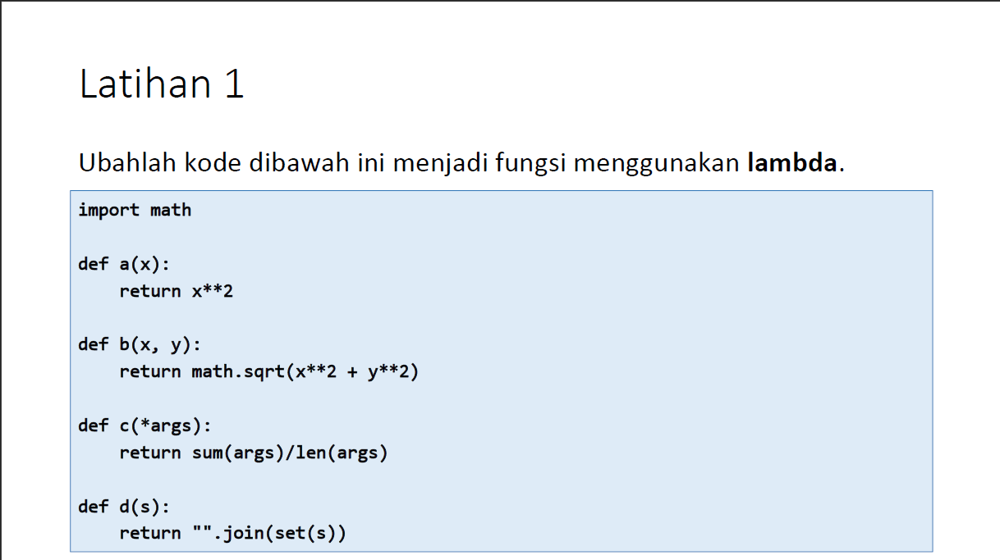<br>
Berikut adalah source code nya
```python
import math


def a(x):
    return x ** 2


def b(x, y):
    return math.sqrt(x ** 2 + y ** 2)


def c(*args):
    return sum(args) / len(args)


def d(s):
    return "".join(set(s))


# Dirubah menggunakan Lambda

aa = lambda x: x ** 2
bb = lambda x, y: math.sqrt(x ** 2 + y ** 2)
cc = lambda *args: sum(args) / len(args)
dd = lambda s: "".join(set(s))

# output
print("Latihan a")
print("=========")
print("Fungsi\t = ", (a(4)))
print("Lambda\t = ", (aa(4)))
print()
print("Latihan b")
print("=========")
print("Fungsi\t = ", (b(4, 7)))
print("Lambda\t = ", (bb(4, 7)))
print()
print("Latihan c")
print("=========")
print("Fungsi\t = ", (c(10)))
print("Lambda\t = ", (cc(10)))
print()
print("Latihan d")
print("=========")
print("Fungsi\t = ", (d("abcde")))
print("Lambda\t = ", (dd("abcde")))
```
Disini saya sudah rubah ke lambda<br>
Kalau di Tugas Latihan tidak ada outputnya, tp disini saya akan berikan contoh untuk output dari source code tersebut<br>
Berikut outputnya<br>
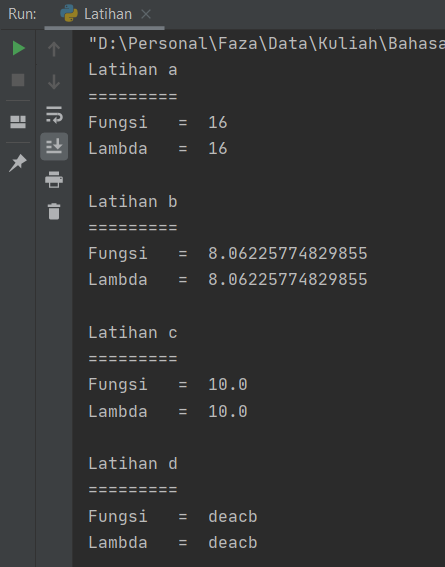<br>

## Tugas Praktikum 6

Untuk tugas 6 bisa dilihat pada gambar dibawah ini<br>
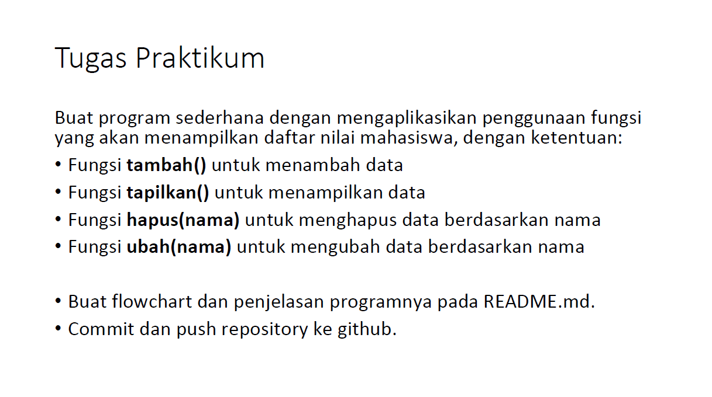<br>
Tugasnya adalah membuat program sederhana data mahasiswa menggunakan fungsi, untuk menambah, menampilkan, menghapus, dan mengubah pada program tersebut<br>
Kurang lebih sama dengan tugas praktikum 5 hanya saja disini untuk menambah, menampilkan, merubah dan menghapus menggunakan fungsi yaitu **def**. Fungsi **def** di state di awal, baru di gunakan di bawahnya seperti source code berikut

```python
data = {}


def tambah():
    print("Tambah Data")
    nama = input("Nama\t\t: ")
    nim = int(input("NIM\t\t\t: "))
    tugas = int(input("NIlai Tugas\t: "))
    uts = int(input("Nilai UTS\t: "))
    uas = int(input("Nilai UAS\t: "))
    nilaiakhir = (tugas * 0.3 + uts * 0.35 + uas * 0.35)
    data[nama] = nim, tugas, uts, uas, nilaiakhir


def tampilkan():
    if data.items():
        print("================================== Daftar Nilai ======================================")
        print("======================================================================================")
        print("|  No  |      NAMA     |      NIM      |   TUGAS  |   UTS   |   UAS   | NILAI AKHIR  |")
        print("======================================================================================")
        i = 0
        for a in data.items():
            i += 1
            print(f"| {i:4} | {a[0]:13s} | {a[1][0]:17} | {a[1][1]:10d} |  {a[1][2]:6d} | {a[1][2]:7d} | {a[1][4]:6.2f} | ")
    else:
        print("===================================== Daftar Nilai ===================================")
        print("======================================================================================")
        print("|  No  |      NAMA     |      NIM      |   TUGAS  |   UTS   |   UAS   | NILAI AKHIR  |")
        print("======================================================================================")
        print("|                                    Tidak Ada Data                                  |")
    print("======================================================================================")


def hapus():
    print("Hapus Data Nilai Mahasiswa")
    nama = input(" Masukan Nama\t:")
    if nama in data.keys():
        del data[nama]
        print()
        print("================================")
        print("====BERHASIL MENGHAPUS DATA====")
        print("================================")
    else:
        print("Data {0} tidak ada".format(nama))


def ubah():
    print("===============================")
    print("===Edit Data Nilai Mahasiswa===")
    print("===============================")
    nama = input("Masukan Nama\t\t: ")
    print("===============================")
    if nama in data.keys():
        nim = input("NIM baru\t\t\t: ")
        tugas = int(input("Nilai Tugas Baru\t: "))
        uts = int(input("Nilai UTS Baru\t\t: "))
        uas = int(input("Nilai UAS Baru\t\t: "))
        nilaiakhir = (tugas * 30 / 100 + uts * 35 / 100 + uas * 35 / 100)
        data[nama] = nim, tugas, uts, uas, nilaiakhir
        print()
        print("================================")
        print("=====BERHASIL MENGUBAH DATA=====")
        print("================================")
    else:
        print("Data nilai {0} tidak ada ".format(nama))


while True:
    print("")
    print("================================")
    print("======== DATA MAHASISWA ========")
    print("================================")
    x = input("(L)ihat \n(T)ambah \n(U)bah \n(H)apus \n(K)eluar \nPilih menu : ")
    if x.lower() == "l":
        tampilkan()
    elif x.lower() == "t":
        tambah()
    elif x.lower() == "u":
        ubah()
    elif x.lower() == "h":
        hapus()
    elif x.lower() == "k":
        print()
        print("=================================")
        print("====== KELUAR DARI PROGRAM ======")
        print("=================================")
        break

    else:
        print()
        print("==================================")
        print("== Pilihan Anda Tidak Tersedia ==")
        print("== Pilihlah Menu Yang Tersedia ==")
        print("==================================")

```

Penjelasan :
* **data = {}**, disini saya akan menggunakan **dictionary** untuk menampung data mahasiswa
* Untuk menambah data, menampilkan, mengubah dan menghapus data, sama ***source codenya*** seperti ***source code*** di tugas 5 hanya saja di masukkan ke dalam fungsi dan saya sedikit merubah tampilannya<br>
* Setelah semua di masukan ke dalam fungsi, maka baru buat perulangan dengan **while true** dan masukkan fungsi - fungsi ke dalamnya seperti berikut
    ```python
    while True:
        print("")
        print("================================")
        print("======== DATA MAHASISWA ========")
        print("================================")
        x = input("(L)ihat \n(T)ambah \n(U)bah \n(H)apus \n(K)eluar \nPilih menu : ")
        if x.lower() == "l":
            tampilkan()
        elif x.lower() == "t":
            tambah()
        elif x.lower() == "u":
            ubah()
        elif x.lower() == "h":
            hapus()
        elif x.lower() == "k":
            print()
            print("=================================")
            print("====== KELUAR DARI PROGRAM ======")
            print("=================================")
            break
    
        else:
            print()
            print("==================================")
            print("== Pilihan Anda Tidak Tersedia ==")
            print("== Pilihlah Menu Yang Tersedia ==")
            print("==================================")
    ```
  Maka outputnya akan menjadi seperti berikut<br>
  * Menu Lihat
    * Tanpa data atau belum ada data yang di inputkan<br>
    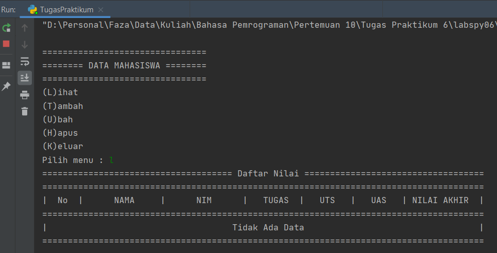<br>
    * Dengan ada data
    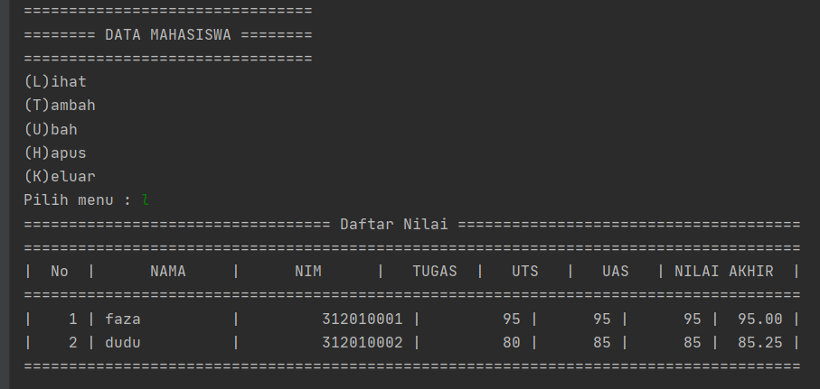<br>
    
    
  * Menu Tambah
  Disini saya mencoba menambahkan 2 data<br>
  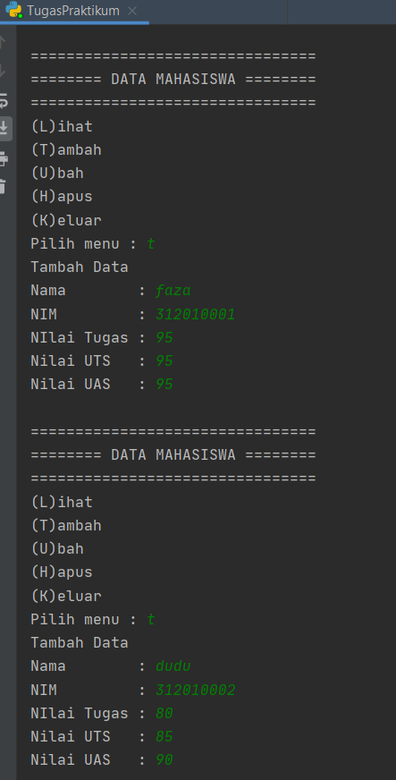<br>
  
  
  * Menu Ubah
    * Bila berhasil mengubah data<br>
    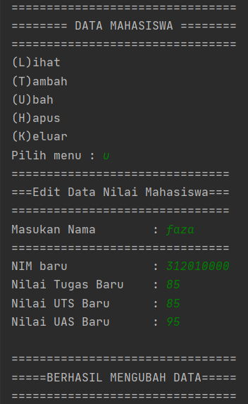
    * Setelah mengubah data, lalu melihat data yang diubah<br>
    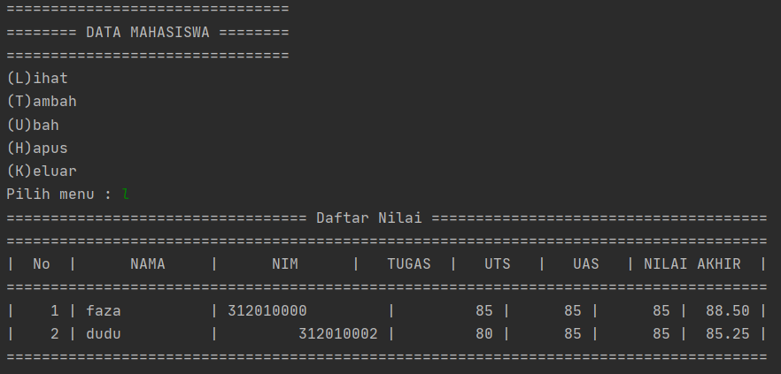<br>
  
  
  * Menu Hapus
    * Bila berhasil menghapus data<br>
    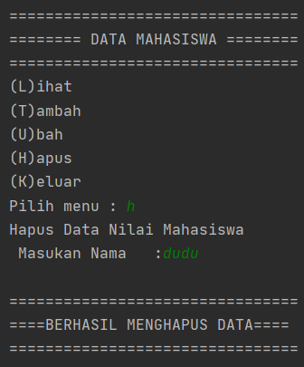
    * Lalu dilihat datanya<br>
    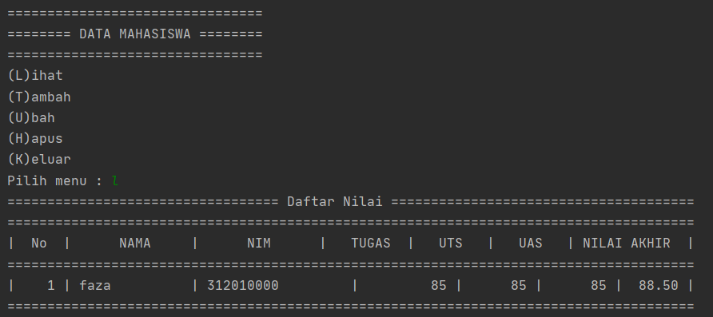<br>
    Data yang berhasil di hapus sudah tidak ada lagi pada tabel
    
    
  * Menu Keluar<br>
  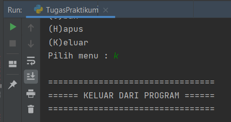
  

Sekian, Terima kasih<br> 

**==================================================================**<br>
**========================= FAZA ARDAN KUSUMA ========================**<br>
**============================= 312010001 =============================**<br>
**============================== TA.20.B1 =============================**<br>
**============================ TERIMA KASIH ==========================**<br>
**==================================================================**